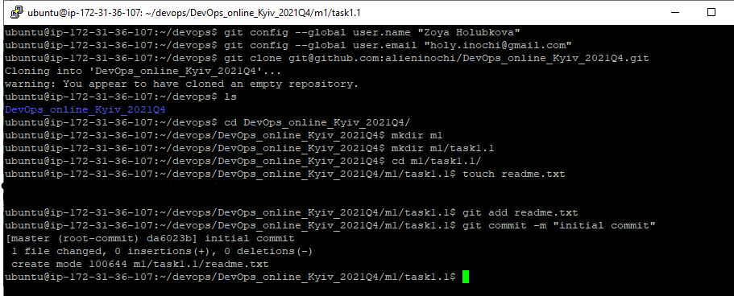
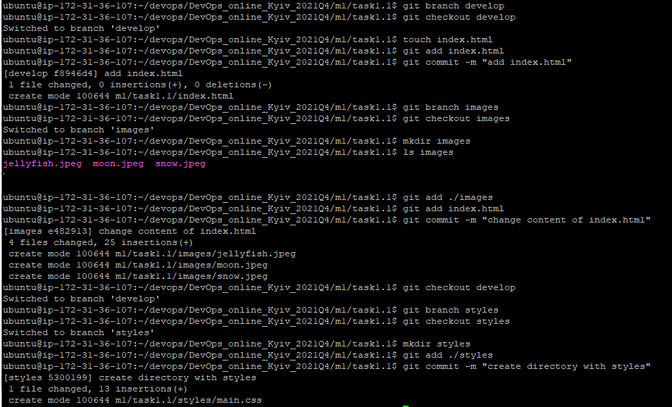
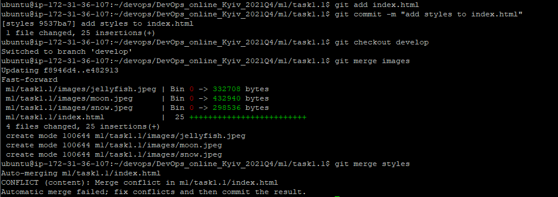
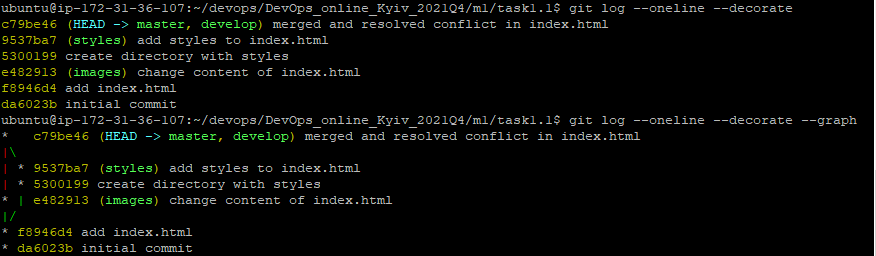

# Task 1.1

***

## 1.1.1 Results of my work with Git

I've created private repository on Github which will include results of all future tasks. The next step was setup git global config and clone repository to the local machine. After some preparations I've made initial commit.

Next, I've created three different branches, each contains different versions of index.html and tried to merge it, but there was a merge conflict. After resolving conflict I've merged "develop" into "master"

Also I experimented with git log and its different flags

More actions with repository you can see in task1.1_GIT.txt file.

## 1.1.2 What is DevOps?
Devops engineer interacts with different IT departments, such as development and testing departments. 
He is also involved in the maintenance and support of software development.