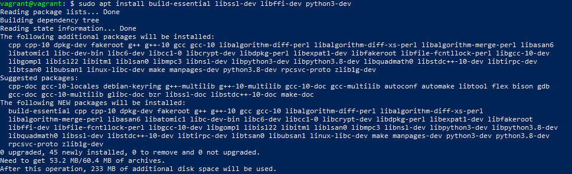

# Task 2.1  
 
***

## Part 1  

1. What are the most popular hypervisors for infrastructure virtualization?  
  
There are 2 types of hypervisors: native hypervisors and hosted hypervisors.  
First type cosidered as more productive, so exactly this type of hypervisors often used for infrastructure virtualization.  
To the most popular hypervisors in this category relates Microsoft Hyper-V, VMware vSphere, Oracle VM Server etc.  
  
2. Briefly describe the main differences of the most popular hypervisors.  
  
Differences between Hyper-V and VMware:  
- VMware most expensive than Hyper-V;  
- VMware has failover mechanism, Hyper-V doesn't;  
- Hyper-V solution is less demanding on the hardware side;  
- VMware has special tools for balancing loads across host resources, Hyper-V doesn't;  
- Hyper-V allows saves on licensing software, which are installed on virtual machines.  
- VMware has better realization of VDI, but in Hyper-V its more cheap.  

## Part 2  
1. I've created the VM called "ubuntu-server-holubkova" and install on it last version of Ubuntu Server. After installation, I've made a full clone of this machine and unite both of them into a group called "Ubuntu".

  
  
2. For VM1 I made tree of several snapshots:  

 

3. Exporting and importing VM1:  

  

4. Next, I've configured USB to connect the USB ports of the host machine to the VM: 

5. For creating shared folder between host machine and VM, first, I've installed VirtualBox guest additions for Linux.  
After that I created shared folder in VM settings.  

  

On the host machine I have some files:  

 

and the same files appeared on VM:  

6. Different network modes:  
  
- NAT Network:  
VM1 IP:  

  

Host IP:  

  

Ping from VM to host:  

  

With this network mode host can't see VM.  

- Network bridge:  
Host IP the same as in previous paragraph. 

VM1 and VM2 IP:  

  

Ping from VM to host: 

  

Ping from host to VM:  

 

- Virtual host adapter:  
Host IP the same as in previous mode  
IP of VM1 and VM2:  

   

Ping from VM2 to VM1: 

  

Ping from VM1 to host and also to the Internet:  

  

Ping from host to VM1:  

  

***

Table of connections:
| Mode       |  VM→Host | VM←Host      | VM1↔VM2 | VM→Net/LAN | VM←Net/LAN   |
|:----------:|:--------:|:------------:|:-------:|:----------:|:------------:|
| Host-only  | +        | +            | +       | -          | -            |
| Internal   | -        | -            | +       | -          | -            |
| Bridged    | +        | +            | +       | +          | +            |
| NAT        | +        | Port forward | -       | +          | Port forward |
| NATservice | +        | Port forward | +       | +          | Port forward |

7. Work with VBoxManage  
I've executed some commands of VBoxManage in CLI:  

  

  

  

## Part 3

1. I've created directory "student_holubkova", initialized envinronment and run vagrant in it:

2. Connecting to VM through SSH, login and printing date:

3. Stop and deleting VM:

4. Creating own Vagrant box.  
First, I've download box with Ubuntu from Vagrant website:  

   

I've decided to add to the box the ability to create virtual Python environments with all installed packages, without the need for preliminary configuration.  
Install the required packages:  

  

  

Setup template for environments:

  

After all neccessary setups, I exited from Ubuntu and made copy of current state of this box:  

  
