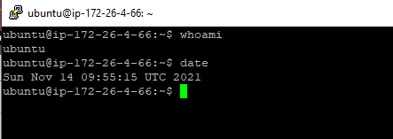
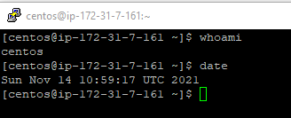

# Task 2.2

***

1. I've created Lightsail instance: 

Instance is ready and already running:

I've connected to the instance through puTTY on my local machine:

2. I've created EC2 instance, for OS was chosen CentOS 6.

This instance in list of all instances:

Connecting to the instance through puTTY:

3. I've made snapshot of this instance:

4. I've created EBS volume:

and attached it to my CentOS instance, mounted it and created new file:

5. I've created OS image based on snapshot that I've made in previous steps.

In "Launch instance" I choose "My AMIs" and create instance the same as instances from AWS AMIs.

6. I've detached Disk_D from first inctance and attached it for instance from snapshot:

7. I've created Lightsail Wordpress instance:

Administrator's panel:

I've attached static IP to instance:

and made DNS record for my domain:

Site works on this domain:

8. Work with S3:

- Create bucket:

- Upload files to bucket:

9. Work with S3 through command line:

I've created new user in IAM:

I've created file on local machine and uploaded it to my bucket:

File appeared in bucket:

10. Docker Container Deployment on Amazon ECS:

Creating cluster:

Running demo app:

11. [My link to a static website with my AWS completed labs](http://zoeholubkovainfo.s3-website.eu-central-1.amazonaws.com/)