# Task 3.1

***

Network scheme from this task was repeated:

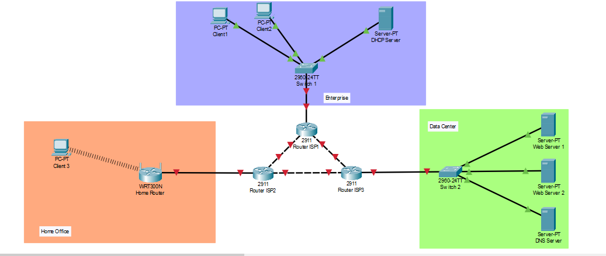

Client1 has IP 10.0.8.10
Client2 - 10.0.8.20
DHCP server - 10.0.8.100

Ping from Client1 to Client2 and DHCP:

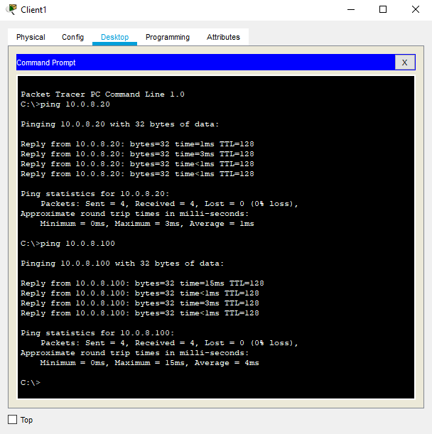

Client3 has IP 192.168.0.18

Ping from Client3 to home router:

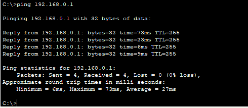

***

Analyzing traffic with Wireshark:

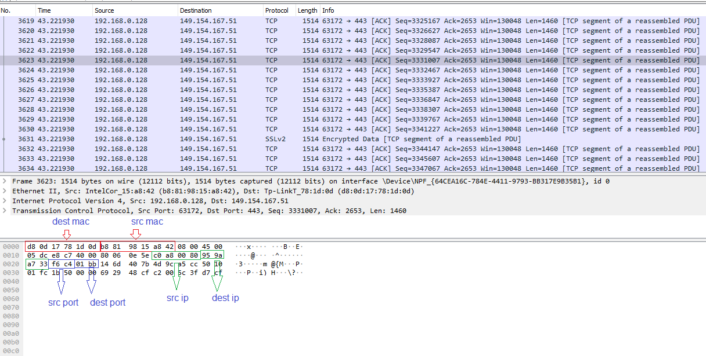

# Task 3.2

***

Router ISP1 has following IP addresses:

GE0/0 - 10.0.8.1/24
GE0/1 - 18.3.0.1/26
GE0/1 - 18.3.0.65/26

IP addresses for Router ISP2:

GE0/0 - 18.3.0.128/26
GE0/1 - 18.3.0.2/26
GE0/1 - 18.3.0.66/26

IP addresses for Router ISP3:

GE0/0 - 3.8.0.1/24
GE0/1 - 18.3.0.3/26
GE0/1 - 18.3.0.67/26

Machines in Enterprise section have default gateway 10.0.8.1.
Ping from DHCP server to gateway:

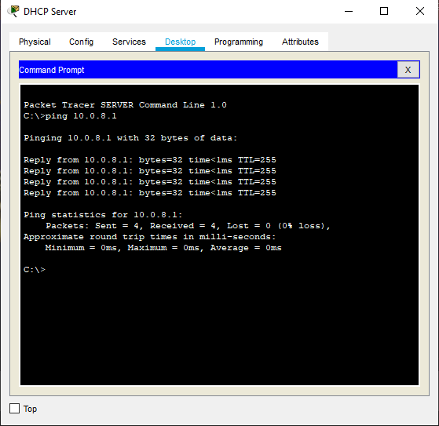

Servers in Data Center have default gateway 3.8.0.1.
Ping from DNS server to gateway:

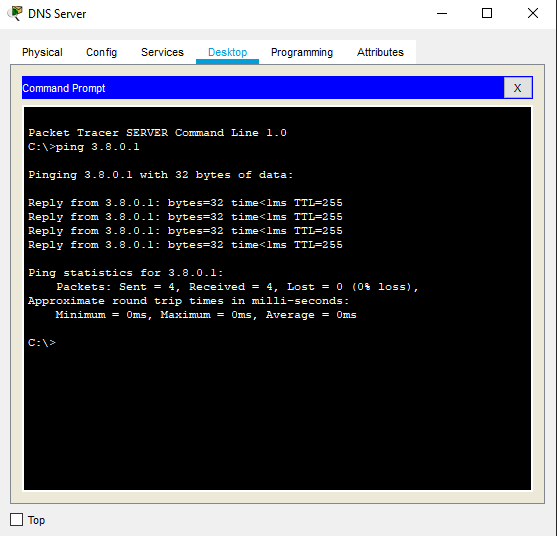

Web Server 1 has IP 3.8.0.50/24
Web Server 2 has IP 3.8.0.100/24
DNS Server has IP 3.8.0.150/24

Ping and trace route between them:

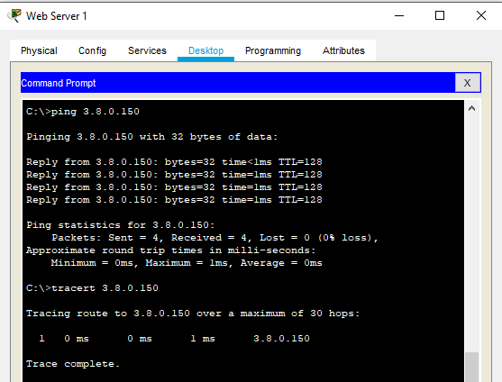

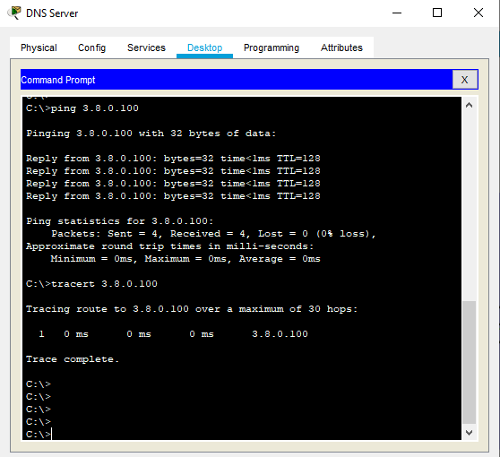

After changing mask to /26, servers still can ping each other, but trace route increased to 1 hop, because now servers in different subnets and packets need to go through router which routes them to another subnet.

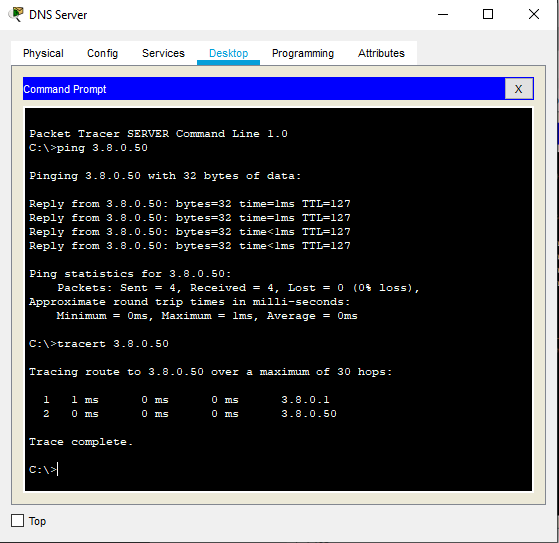

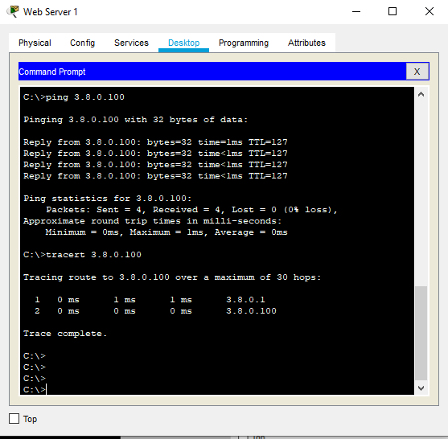

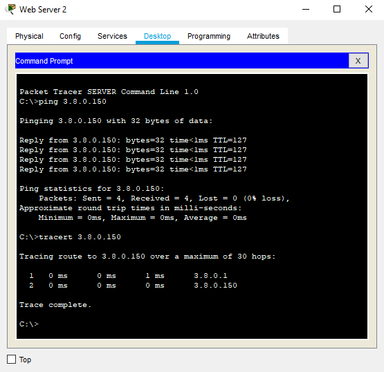

Work with VLANs:

I've created 3 VLANs and assigned them to the insterfaces according to their names:

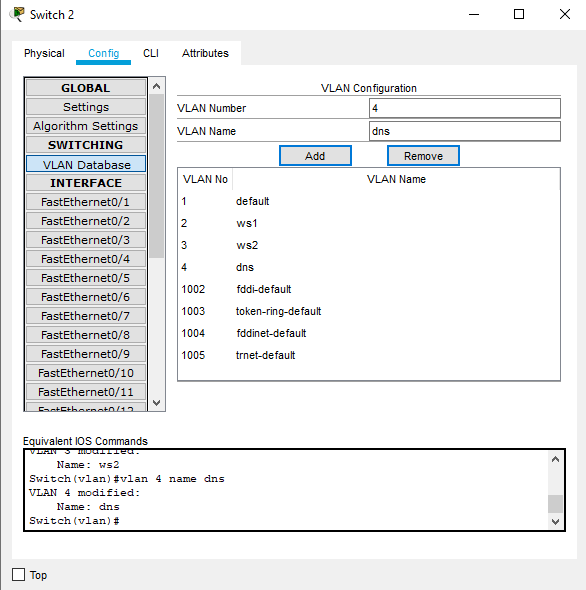

When servers are in different VLANs, they wouldn't ping, even if they are in same subnet.

To set up routing between different VLANs, I've switched interface FE0/1 on switch to trunk mode.
On router I've created 3 subinterfaces in interface GE0/0:

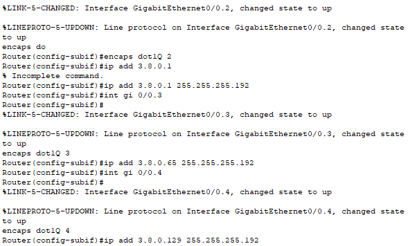

And in servers config I've changed gateways according to subinterfaces:

Web Server 1 has default gateway 3.8.0.1
Web Server 2 - 3.8.0.65
DNS Server - 3.8.0.129

After that manipulations servers can see each other:

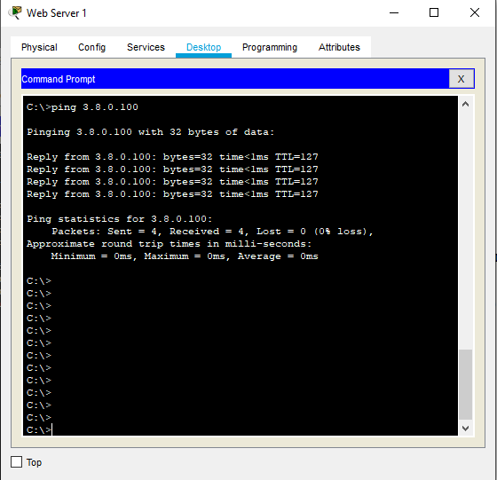

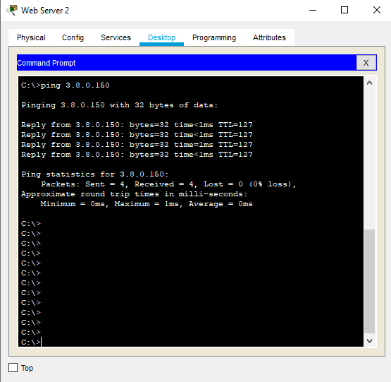

