# Task 4.1

## Part 1

I've created a database schema for Internet Service Provider, that consits of four tables:

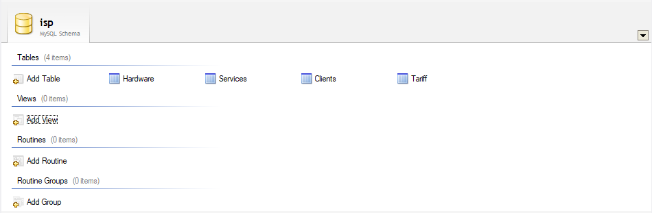

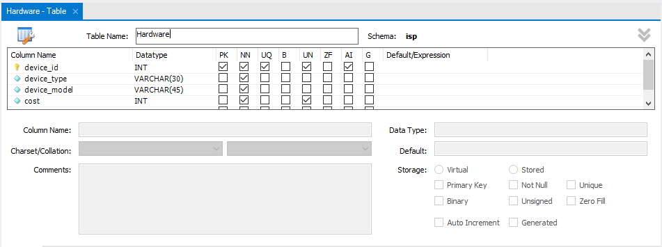

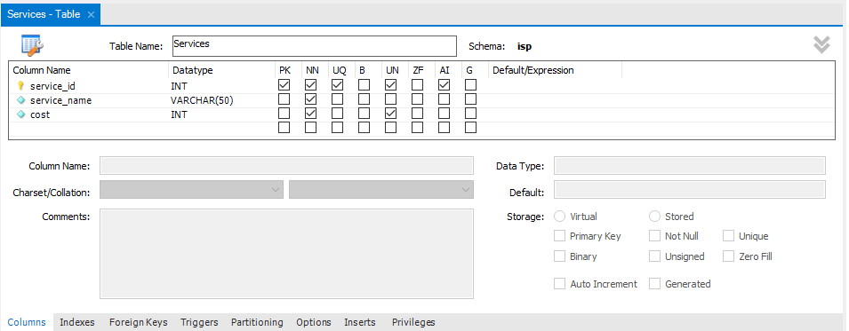

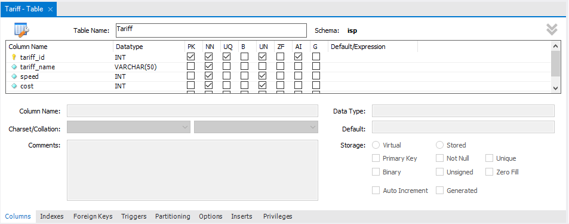

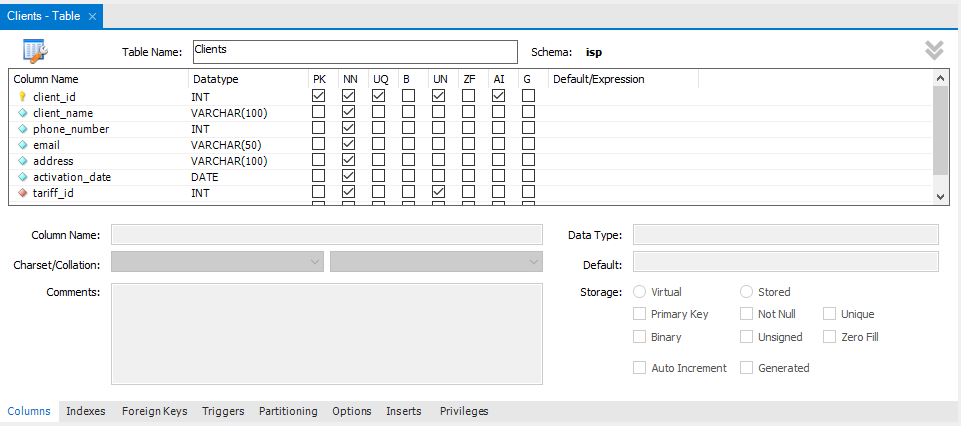

For "Clients" table, column named "tariff_id" is foreign key, which take its value from table "Tariffs":

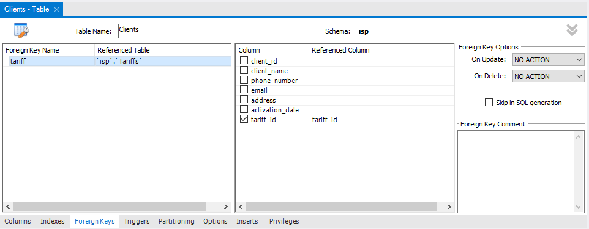

On MySQL server I've created database "internet_provider":

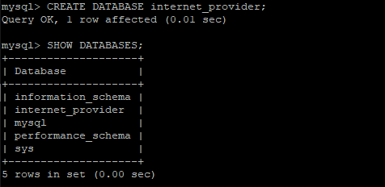

I've switched to my databadse and created tables:

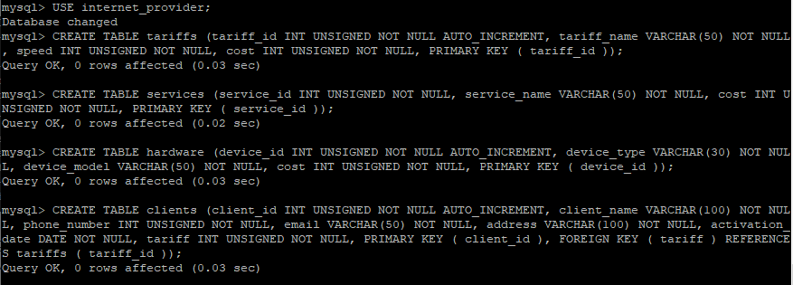

Showing information about table:

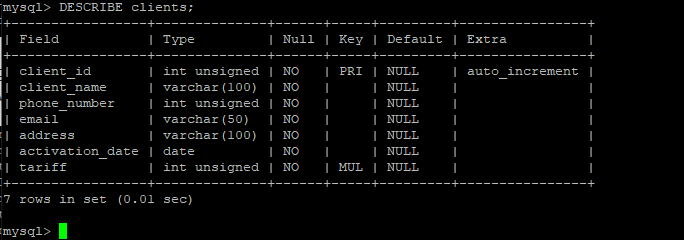

For filling tables previously was prepared CSV files with necessary data.
CSV file with tariffs info:

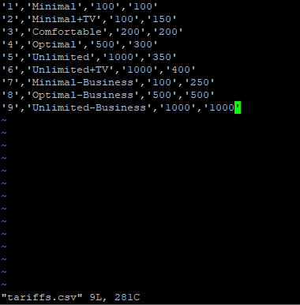

Filling table 'tariffs':

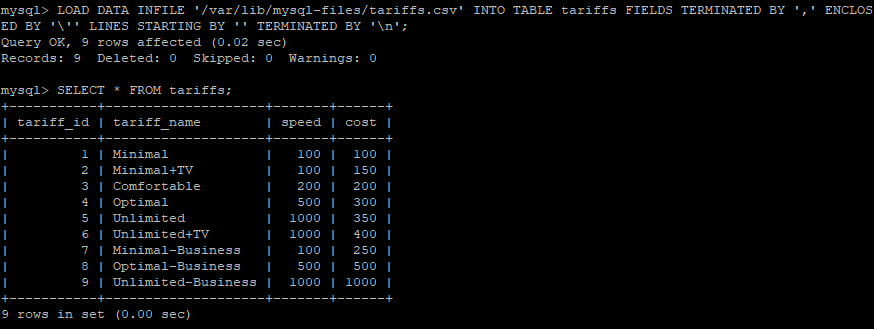

Other tables was filled in the same way.

Adding a single row into a table:

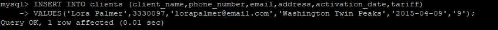

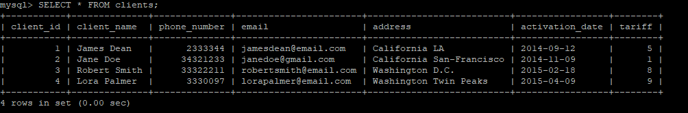

Examples of use different operators with SELECT:

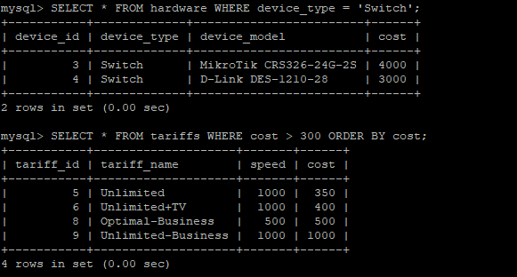

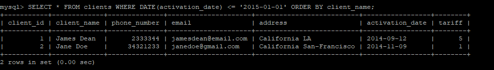

Creating new user and changing his password:

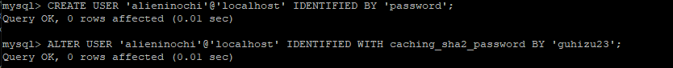

Granting access rights:

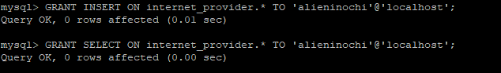

Using different commands through the created user:

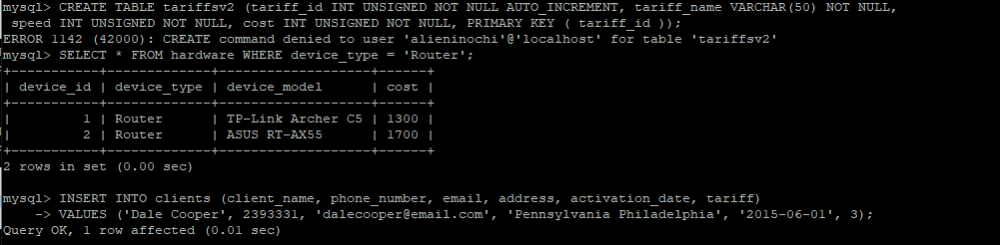

## Part 2

I've created backup of my database:

I've deleted table from database:

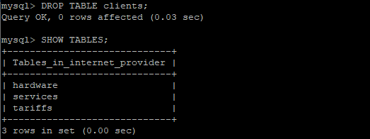

and restored previous version of DB from backup:

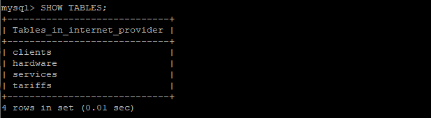

///

## Part 3

I've created AWS Dynamo DB table:

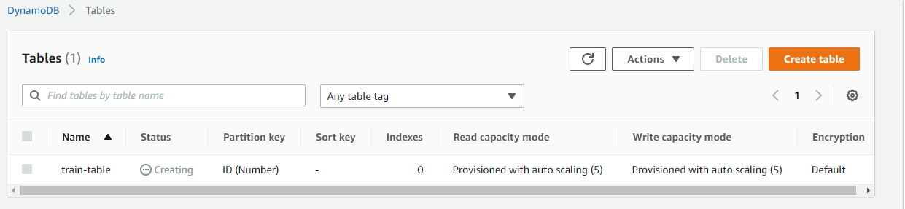

List of items that I've added:

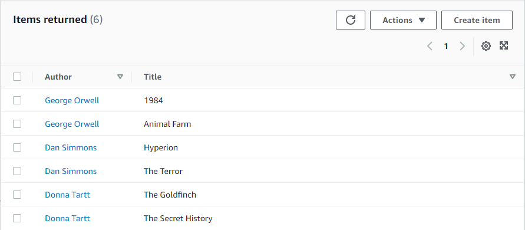

Examples of use Query and Scan:

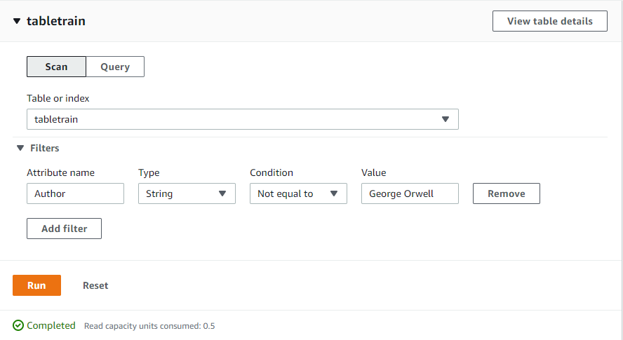

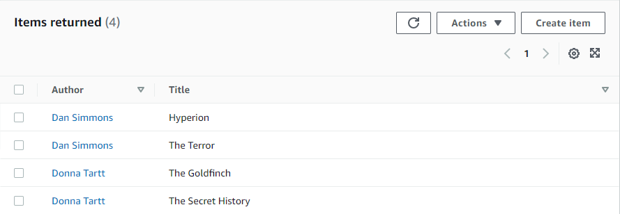

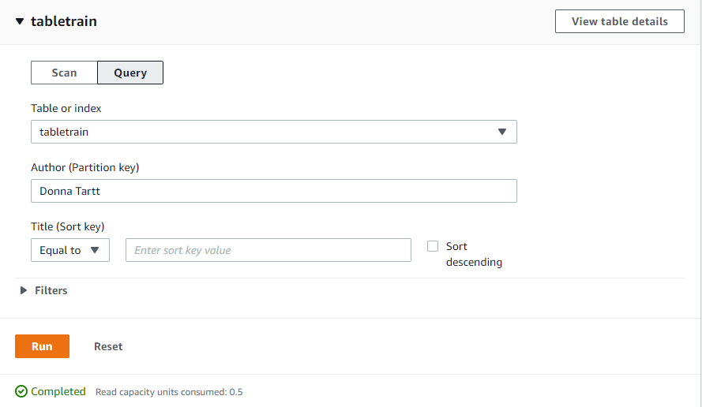

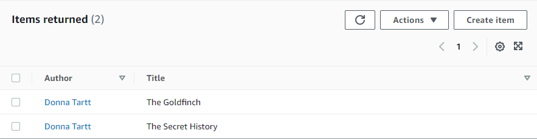