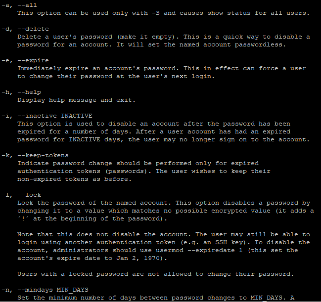

# Task 5.1

***

## Part 1

1. I've logged in to the system as root and changed root's password with passwd command:

Options of passwd command:

System file that changes password stores /etc directory and called "passwd"

Information about users also stores in file "/etc/passwd":

History of commands that user was executed stores in file ".bash_history" in user's directory:

2. I've changed my personal information with command **chfn** and checked it with command **finger**:

3. To find out about the various command options, the man command was used.
passwd - change user password

-d, --delete
Delete a user's password (make it empty). This is a quick way to disable a password for an account. It will set the named account passwordless.

-S, --status
Display account status information. The status information consists of 7 fields. The first field is the user's login name. The second field indicates if the user account has a locked password (L), has no password (NP), or has a usable password (P). The third field gives the date of the last password change. The next four fields are the minimum age, maximum age, warning period, and inactivity period for the password. These ages are expressed in days.

**cat** - concatenate files and print on the standard output

-n, --number
number all output lines

-s, --squeeze-blank
suppress repeated empty output lines

**chfn** - change real user name and information

-f, --full-name FULL_NAME
Change the user's full name.

-o, --other OTHER
Change the user's other GECOS information. This field is used to store accounting information used by other applications, and can be changed only by a superuser.

**finger** — user information lookup program

-m
Prevent matching of user names. User is usually a login name; how‐ ever, matching will also be done on the users' real names, unless the -m option is supplied. All name matching performed by finger is case insensitive.

-s
Finger displays the user's login name, real name, terminal name and write status (as a '\*' after the terminal name if write permis‐ sion is denied), idle time, login time, office location and office phone number.
Login time is displayed as month, day, hours and minutes, unless more than six months ago, in which case the year is displayed rather than the hours and minutes.
Unknown devices as well as nonexistent idle and login times are displayed as single asterisks.

4. In order to change plans, I've created **.plan** file in my home directory and plans was appeared in "Plan" section of finger command:

5. Contents of my home directory:

## Part 2

1. Subdirectories of root directory:

Examples of search files with certain pattern with tree command: 

2. We can do file examination with **file** command:

3. I can go back into my home directory by using absolute path like '/home/username' with 'cd'. Also I can use **cd ~**. **~** is a designation of home directory in Linux.

4. ls -a - output all files, including hidden files.

ls -l - use a long listing format, including size, date, name of owner and group, rights.

5. 

6. Literal file names point to the numeric file descriptor. When we create hard link, we just create another literal name that points to the same file.

Soft links point to the hard links. When we delete this hard link, soft link stops working.

When we change content of soft link, content in original file also changes.

7. 

8. There is only one partition in my system:

9. View the number of lines that contain 'tree' in the file .bash_history:

10. 

11. File search with find, then with grep:

12. Screen-by-screen viewing can be achieved with this sequence of commands:

**sudo -la /etc | less > /dev/pts/0**

13. In Linux all devices are considered as files. This files are stored in /dev directory:

14. Types of files in Linux:

- ordinary files (audio, images, text files etc.) (-);
- directories (d);
- symbolic links (s);
- hard links (-);
- block devices (b);
- socket (s);
- character device (c);

15. 

