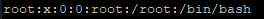

1. /etc/passwd file contains the following fields:

username: password: uid: gid: full_name: directory: shell

Structure of file /etc/group:

group_name: password: group_id: list

Some of pseudo-users in Linux:

daemon - used by system service process;
bin - gives ownership of executable commands;
sshd - used by secure shell server.

2. UID is the unique user identifier associated with his name.
UID ranges from 0 to 65535. 0 is used for root user, 1-999 for daemons, pseudo-users, system and reserved users and 1000+ for regular users.
We can check user's UID with command **id -u user**.

3. GID is the unique group identifier within the system tp which user belongs.
You can check GID of the group with command **id -g user.**

4. **id** with flags -G (shows only group_id) or -Gn (shows only names of the groups)

5. We can add user with using command **useradd**.

Basic parameters:
- **-c** - uid commentary;
- **-d** - user directory;
- **-e** - expire date;
- **-s** - the name of the user's login shell;
- **-u** - UID;
- **-g** - GID.

Adding new user:

6. Change user's account name:

7. Skel directory (usually /etc/skel) contains files that will be copied to the new user's home directory.
Skel directory structure:

8. We can delete user from system with command **userdel**. If we want delete user with his home directory and mailbox we need to use flag **r**.

9. Lock and unlock user's account with **passwd**:

with **usermod**:

Also we can lock user with command **change**. When we use this command, we set expire date for account to past and account locks. We can undo changes just deleting expire date.

10. We can delete password with key **-d** (--delete):

11. Extended information about the directory can be found using the utility **ls** with key **-l**:

1st column - type of file and access rights;
2nd column - specifies the number of links or directories inside directory;
3rd column - the user that owns the file;
4th column - the group that file belongs;
5th column - the size of file in bytes;
6th column - the date of last modification;
7th column - the name of file;

If we add key -i we also can discover inode of files:

12. Characters r, w and x represent three types of access in Linux - read, write and execute. Characters from 2 to 4 mean access rights for user that owns the file,
from 5 to 7 - access rights for user that belongs to group that owns the file, from 8 to 10 - access rights for other users.
If instead of one of the characters there is a -, it means that user has no such right with respect to the file.

13. We can change access rights to the file with utility chmod in two ways. First method is octal format:
0 (---) - no rights;
1 (--x) - execute;
2 (-w-) - write; 3 (-wx) - write+execute;
4 (r--) - read;
5 (r-x) - read+execute;
6 (rw-) - read+write;
7 (rwx) - all above;

For example:

**chmod 764 file**

first number means rights for owner, second for group, third for others. In this example 764 means rwxrw-r--.

Second method is literal, for example:

**chmod u+x file**

u means user, symbol + means add right to existed rights.

14. Usage of **chown** command:

15. Octal representation of access rights:
0 (---) - no rights;
1 (--x) - execute;
2 (-w-) - write; 3 (-wx) - write+execute;
4 (r--) - read;
5 (r-x) - read+execute;
6 (rw-) - read+write;
7 (rwx) - all above;

For example, 644 means **rw-r--r--**.

**umask** command displays or sets default access rights for new files in octal format.
Default access rights for new files is 666 and 777 for new directories.

16. Sticky Bit is mainly used on folders in order to avoid deletion of a folder and it’s content by other users though they having write permissions on the folder contents.
When a directory's sticky bit is set, the filesystem treats the files in such directories in a special way so only the file's owner,
the directory's owner, or root can rename or delete the file.
Sticky bit can be set with **chmod** command.

For example, **/tmp/** directory has sticky bit set.

17ю Command script must be executable for all users which will be execute it. We need to set **x** right for certain user or group which will execute script.