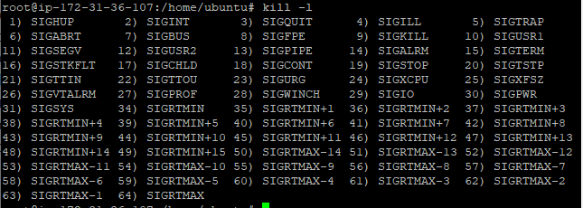

# Task 5.3

## Part 1

1. Process can have 5 states:

- **running** - process has been launched in system;
- **waiting** - process is waiting for some event;
- **idle** - process;
- **completed** - process was stopped with **exit()** signal;
- **zombie** - it's child processes that remain in system after parent process was stopped.

2. Highlighting current processes:

3. /proc/ is a directory that doesn't exist on a disk. Its files is generated by kernel when we appeal to this directory. /proc/ stores files that has information about user's machine and OS kernel.

4. We can get information about CPU in file **/proc/cpuinfo/**:

5. **ps** command usage:

6. Kernel processes is ascendants of process kthread that has PID=2. So, kernel processes PPID=2.
We can find them with ps command:

or with **pstree**:

7. We can print list of all processes with **ps** or **top** commands. For example, usage of **top**:

Processes statuses are displayed in "S" column.

- S - sleeping;
- R - running;
- I - idle;
- Z - zombie.

8. Processes that are launched by specific user:

9. Utilities that can be used to show and analyze running processes:

- ps;
- top;
- atop;
- htop;
- pstree;
- pgrep;
- glances.

10. **top** command has following columns:
- PID - identifier of process;
- USER - user that owns a process;
- PR - process priority on kernel level;
- NI - process priority from -19 (highest priority) to 20 (lowest priority);
- VIRT - virtual memory of process;
- RES - physical memory of process;
- SHR - common memory with other processes;
- S - process status;
- %CPU - CPU usage in %;
- %MEM - memory usage in %;
- TIME+ - amount of CPUs time that was spent to process;
- COMMAND - name of process.

11. We can display porcesses of a specific user with **top -u username**:

12. There are some categories for interactive commands in **top**:

- global commands:

**? | h  :Help**
              There are two help levels available.  The first will
              provide a reminder of all the basic interactive commands.
              If top is secured, that screen will be abbreviated.

              Typing 'h' or '?' on that help screen will take you to
              help for those interactive commands applicable to
              alternate-display mode.

**A  :Alternate-Display-Mode toggle**
              This command will switch between full-screen mode and
              alternate-display mode.

**Z  :Change-Color-Mapping**
              This key will take you to a separate screen where you can
              change the colors for the 'current' window, or for all
              windows.  For details regarding this interactive command
              see topic 4d. COLOR Mapping.

- summary area commands:

**l  :Load-Average/Uptime toggle**
              This is also the line containing the program name
              (possibly an alias) when operating in full-screen mode or
              the 'current' window name when operating in
              alternate-display mode.

- task area commands:

**J  :Justify-Numeric-Columns toggle**
              Alternates between right-justified (the default) and left-
              justified numeric data.  If the numeric data completely
              fills the available column, this command toggle may impact
              the column header only.

**b  :Bold/Reverse toggle**
              This command will impact how the `x' and `y' toggles are
              displayed.  It may also impact the summary area when a bar
              graph has been selected for cpu states or memory usage via
              the `t' or `m' toggles.

- color mapping commands:

When you issue the **'Z'** interactive command, you will be presented
       with a separate screen.  That screen can be used to change the
       colors in just the 'current' window or in all four windows before
       returning to the top display.

13. Sorting the contents of processes:

by memory usage:

by processors time:

14. Priority of process defines how much proccesors time will be given to this process. The highest priority has value of -19 and the lowest - 20.
We can use **nice** command to appoint priority for process that will just be launched

**renice** command can be used to change priority of running process:

15. We can change priority of process, when **top** is launched. We need to press **r** and type PID of process which priority we want to change.

16. Review of all existing **kill** command signals:

Most popular signals: 

SIGHUP (1) — send to process when its terminal was closed.
SIGINT (2) — send to process when user stops the process with Ctrl+C.
SIGQUIT (3) — send to process when user stops the process with Ctrl+D.
SIGKILL (9) — this signal stops process immediately.
SIGTERM (15) — signal of program completion. This is default kill signal
SIGTSTP (20) — send to process with stop request. It usually happens when user clicks Ctrl+Z.

Killing process: 

(719 is PID of process).

17. We can use **jobs** command to examine what processes are working in the background.
When process is stopped, we can get it back with commands **fg** and **bg**. **fg** launches process in foreground mode and **bg** in background.

Example of use **jobs, fg, bg**:

## Part 2

1. The most used OPENSSH commands in Windows:

2. Steps to increase SSH connection security:

- use another port for connection

- disable root login

- use public/private keys for authorization (for example we can generate it with **ssh-keygen**)

- configure idle timeout

- disable empty passwords

- allow access only to certain users

3. Keys types that SSH allow to use for encryption:

By default, RSA key is generated:

Other type of key generation:

Also SSH supports keys with 2FA authentication, but for this we special device called YubiKey.

4. Port forwarding setup:

Connection to VM that behind NAT:

5. For capturing traffic I've used tcpdump:

tcpdump -vv -i 5 -nn port 22 -w dump_ssh.pcap - for SSH connection;
tcpdump -vv -i 5 -nn port 23 -w dump_telnet.pcap - for Telnet.

Results:

From these screenshots we can conclude that we have to use only SSH for connetion to remote servers, because SSH sends encrypted data.