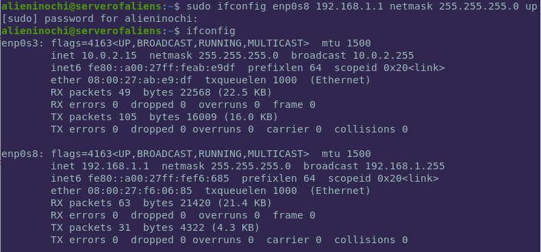
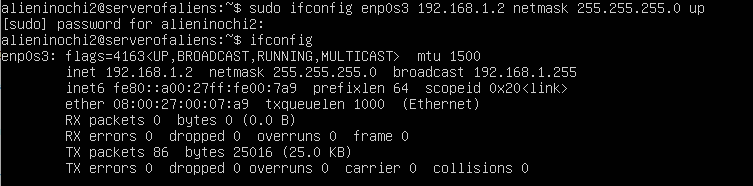
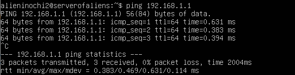
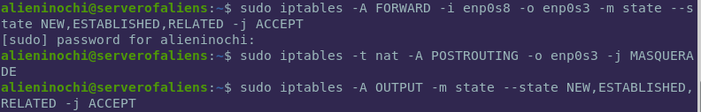
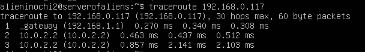
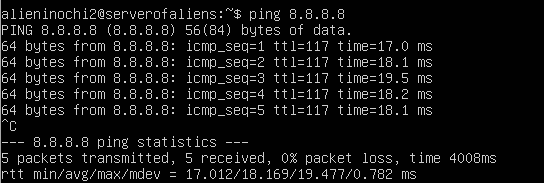
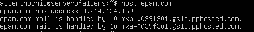
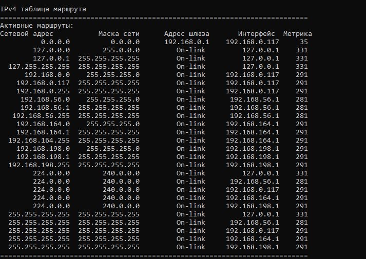
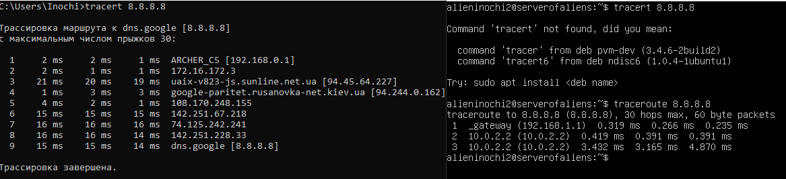

# Task 6.1

1. I've configured two VMs, VM1 has NAT and internal network interfaces, and VM2 only internal:

Check connection between VMs:

2. Configuring interfaces in order to VM2 has access to Internet:

On VM2 we add default gateway 192.168.1.1 (address of internal interface of VM1):

**route add default gw 192.168.1.1**

On VM1 we enable forwarding in file /etc/sysctl.conf, line **net.ipv4.ip_forward=1**

On VM1 we set some iptables rules:

1st - we allow connections from internal interface (enp0s8) to external (enp0s3);
2nd - we enable NAT forwarding on machines in local network;
3rd - we allow VM1 has access to Internet too.

3. Check route from VM2 to host machine:

4. VM2 has access to the Internet:

5. dns.google has IP 8.8.8.8

6. epam.com has IP 3.214.134.159

7. Host has default gateway 192.168.0.1
I've got routing table using command **route print**:

8. Trace to google.com from host and VM2:

