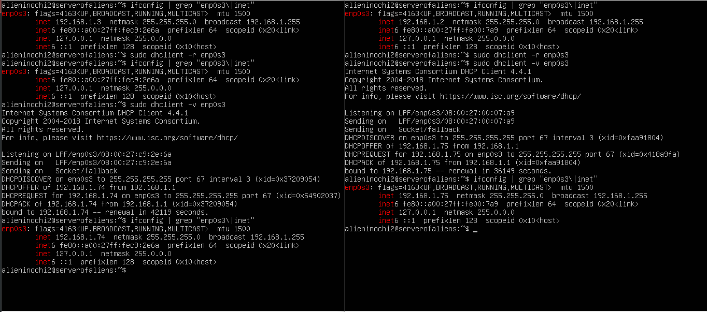

# Task 6.2

1. Work with DHCP

1.1. DNSMASQ

I've uncommented some rows in DNSMASQ configuration file (/etc/dnsmasq.conf):

- set interface where DHCP server will work;
- set network range and time of rent;
- set subnet mask;
- set default gateway;

For setting DHCP client I've used **dhclient**

dhclient -r interface - drops current IP address
dhclient -v interface - allows to get new IP from DHCP server

Results on VM2 and VM3:

1.2. ISC DHCP

Firstly, we need to specify which interface will be used for DHCP in file **/etc/default/isc-dhcp-server**:

Then, in file **/etc/dhcp/dhcpd.conf** we specify options for DHCP server:

and restart isc-dhcp service with systemctl.

Results on VM2 and VM3:

2. Work with DNS

I've choosed DNSMASQ for setup. 

In file **/etc/dnsmasq.conf** I've wrote some rules:

Next, I've disabled systemd-resolved.service in order to dnsmasq can listen on port 53 and made some changes in file **/etc/resolv.conf**:

DNS server has IP 192.168.2.1.

On VM2 and VM3 we need to add this address to file /etc/resolv.conf
Check access to this DNS server on VM2 and VM3:

